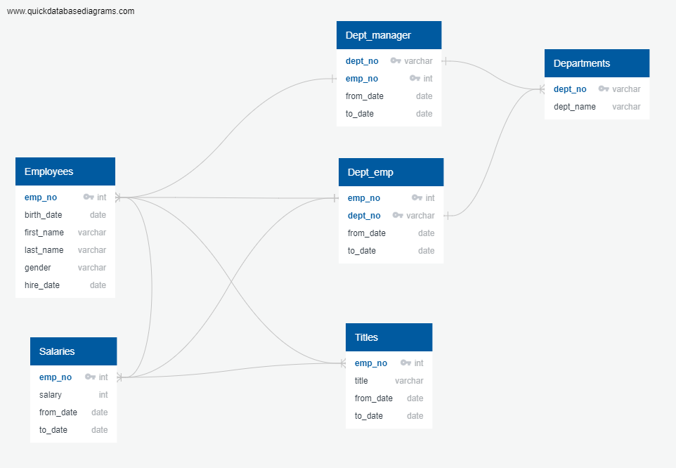
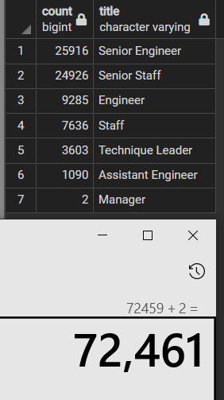
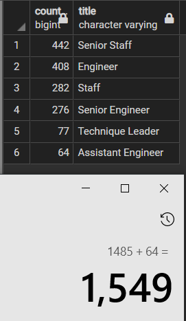
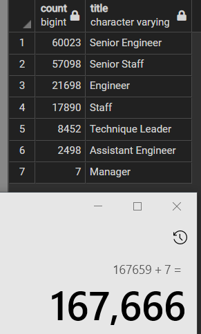

# Pewlett-Hackard-Analysis

## Overview of Project

**Purpose:**  
The purpose of this project is to use queries and tables to build an employee database. Using this database to filter retiring employees and eligible emplyees for a mentorship program based on employee title and roles.  

## Resources:  
- Data Source: employees.csv, dept_manager.csv, dept_emp.csv, departments.csv, salaries.csv, titles.csv
- Software: pgAdmin 4, [quickdatabasediagrams](https://www.quickdatabasediagrams.com/)  

## Analysis and Results  

**Analysis:**  
  
For this analysis, we used pgAdmin to create queries and tables to filter through our data to acquire employee information. We filtered and removed people who had been working at the company but have left the company as they were included in the tables provided. Additionally, we filtered and removed employees who have held different or multiple titles through job transfers or promotions (ie engineer vs. senior engineer) to prevent "double counting." From there, we can calculate the total number of employees for each position and the overall total employees that will be retiring.  

Additionally, we refractored our queries to calculate the number of employees who would be eligible to be part of a mentorship program to help train up and coming employees with less experience compared to their senior employees.  

**Results:**  
- Number of employees retiring:  
We used birthdates of employees that were born in 1952-1955 as a parameter for employees retiring. We filtered those employees into different groups based on their current title. Looking at the image below, we calculated 72,461 total employees that will be retiring.  

- Title of employees retiring:  
From the total employees that are retiring, we separated them into different groups based on their current title. 25,916 Senior Engineering employees and 24,926 Senior Staff employees will be retiring per our image below.  
  

- Number of employees eligible for mentorship program:  
We filtered our data by employees born in 1965, we also had to filter and remove duplicate employees who have held different titles in the past and grouped them by their current title (see image below). We calculated a total of 1,549 employees who are eligible for the mentorship program.  

- Title of emplyees eligible for mentorship program:   
We can see from the image below, there are not many employees that are eligible for the mentorship program. Especially since we know that Pewlett Hackard is a fairly large company based on the data provided.  
  

## Challenge Summary  

**Summary**  
Perform an analysis on number of employees retiring and employees eligible for a mentorship program, we are able to provide accurate reports on how many positions that will need to be filled, as well as the roles of those positions. The same analysis and results were reported for our analysis on the mentorship program. From our analysis, we calculated a total of 72,461 employees that will be retiring from the company. And a total of 1,549 employees qualify for the mentorship program. We can conclude that the number of employees retiring are realtively high compared to the number of employees for the mentorship program. I calculated 167,666 employees that will continue to work at the company (166,117 employees if you subtract the mentor employees). This is about 107 employees per mentor if each employee gets a mentor. I would think this ratio would be overwhelming for the mentors, and would either have to limit our mentee to mentor ratio or change the eligibility requirements for the mentorship program to increase the number of mentors or decrease the number of mentees.  
  

### Codes Used  
Tables of [schema](https://github.com/tonywang3571/Pewlett-Hackard-Analysis/blob/master/Queries/schema)  
Code for [queries](https://github.com/tonywang3571/Pewlett-Hackard-Analysis/blob/master/Queries/Employee_Database_Challenge.sql)  