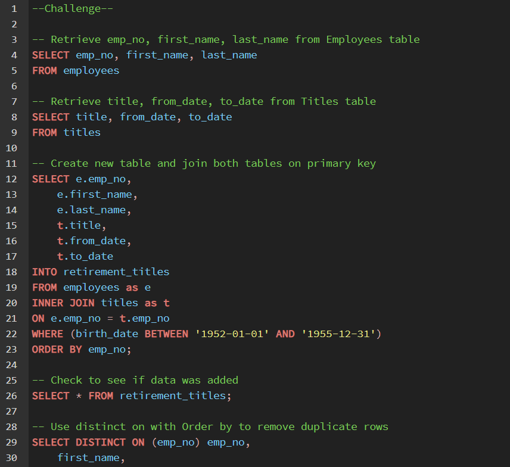
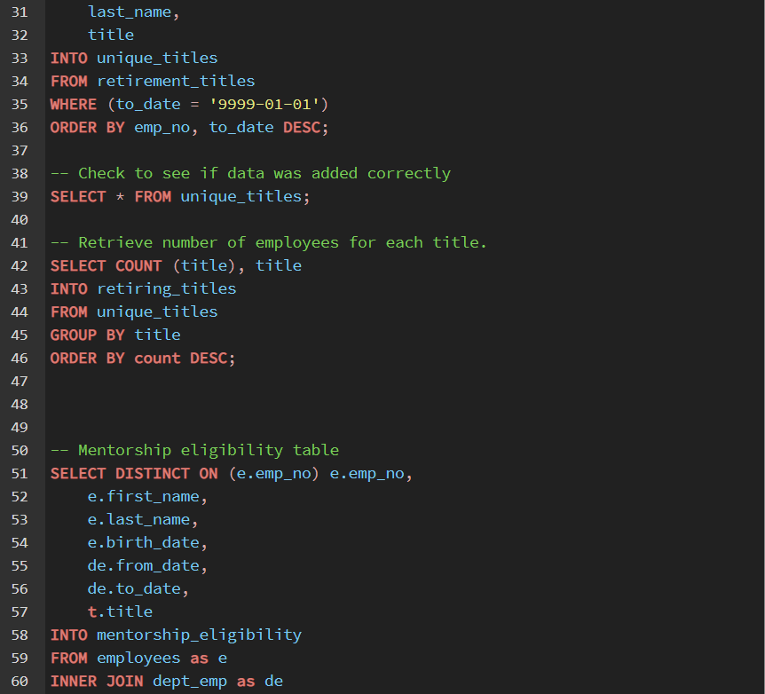
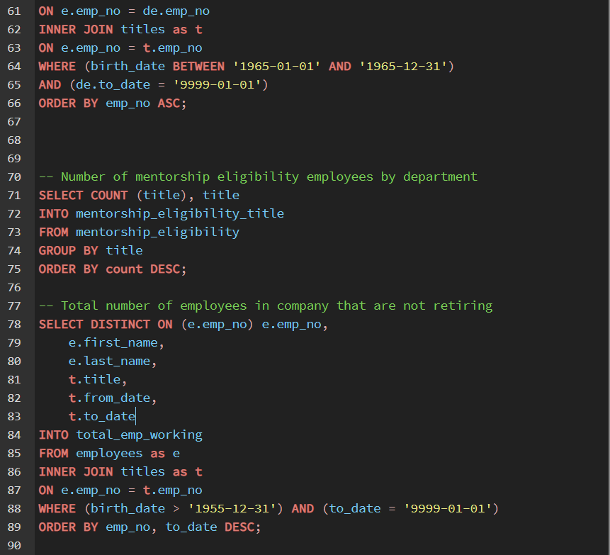
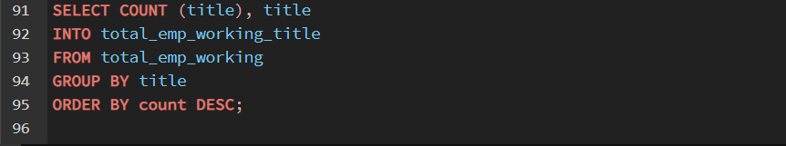

# Pewlett-Hackard-Analysis

## Overview of Project

**Purpose:**  
Bobby, an HR analyst working for Pewlett Hackard, I were tasked with figuring out who and how many people will be retiring in the next few years. Using SQL, we will be writing queries and using tables to build an employee database. From this database, we can figure out who will be retiring, how many employees will be retiring, and from which department they will be retiring from.  

## Resources:  
- Data Source: employees.csv, dept_manager.csv, dept_emp.csv, departments.csv, salaries.csv, titles.csv
- Software: pgAdmin 4, [quickdatabasediagrams](https://www.quickdatabasediagrams.com/)  

## Analysis and Results  

**Analysis:**  
For this analysis, we used pgAdmin to create queries and tables to filter through our tables to aquire information on employee number, name, title, and how long they have been holding those specific titles. Remembering our goal, figuring out who and how many people were retiring from each department, we had to filter out and remove people who had been working at the company and have left the company. As well as people who have held different or multiple titles through job transfers or promotions (ie engineer vs. senior engineer). From there, we can calculate the total number of employees from each department and the overall total employees.  

**Results:**  
- Major Point  

- Major Point  

- Major Point  

- Major Point  

- Major Point  

## Challenge Summary  

**Summary**  

### Codes Used  
  
  
  
  